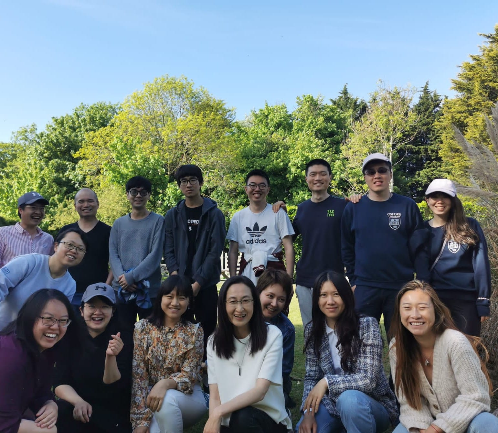
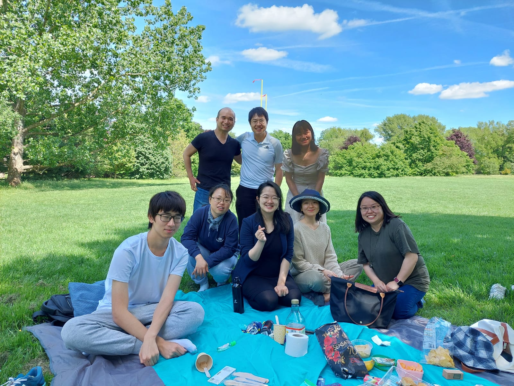

# Oxford Chinese Student Fellowship 牛津华人学生团契

“我就是道路，真理，生命。” John 14:6

 

## 团契简介 WHO WE ARE

### 什么是团契 WHAT IS A FELLOWSHIP?
团契(κοινωνία, communio)意为“联合”“分享”或者“共同体”，在新约圣经语境中往往指多名信徒在持守共同信仰的基础上组成的生命共同体。我们的团契是由有着不同背景的基督徒和乐于探索真理的朋友们因为共同的志趣，在包容与爱心、关怀与支持中建立的大家庭。

### 我会在团契里遇见谁 WHO WILL I MEET?
我们是一群栖居牛津的学人和职场青年。在团契里，你会遇到不同专业、爱好迥异的师兄师姐；我们乐意与你分享牛津的学习与生活点滴，以及如何在其中经历耶稣基督的爱。

### 团契有什么活动 WHAT DO WE DO?
我们有圣经研读、专题讲座(涵盖艺术、历史、科学与社会热点话题)、茶话会等多种丰富的室内活动。此外亦有野餐、徒步、骑行与球类运动等多种室外活动。

### 团契与教会 FELLOWSHIP AND CHURCH
牛津校园团契隶属于[牛津华人福音教会](https://www.ocgc.org.uk/)，成立于2010年。作为基督徒和慕道友，对圣经真理的观察、探讨与寻求是我们日常生活中不可或缺的一部分。以下是我们的每周常规聚会时间，欢迎加入：

+ 校园团契聚会时间: 
  每周五 18:00- 20:00  
  地点: St Michael at the NorthGate, Cornmarket Street, Oxford OX1 3EY  

+ 周日主日崇拜时间:
  (国语) 每周日 10:00 -11:30  
  (粤语) 每周日 12:00- 13:30  
  地点: Oxford High School, Belbroughton Rd, Oxford Ox2 6XA  

作为一个大家庭，我们在牛津一同奔跑、一同成长，分享大学生活的起起伏伏与酸甜苦辣。在新学期来临之际，欢迎参与我们的周五团契聚会以及之后一系列的精彩活动。

 

## 联系方式 CONTACTS

+ 教会网址: https://www.ocgc.org.uk/
+ 邮箱: oxch-stufellowship@outlook.com
+ 电话: 0752 9932 230
+ 微信: shellpickingboy
+ IG: cgcostudents

 

## 团契经历 PERSPECTIVES

### Grace姊妹·香港·剑桥音乐系本硕生
> “在团契的这几年，我感受最深的是彼此相爱、互相支持和弟兄姊妹追求真理的热诚！这些都让我看出从神而来的爱。”
“...我们爱，因神先爱我们。虽你我不一样，我们一路唱， 走往祝福的方向。我们爱，因神先爱我们。心再坚强也不要独自飞翔... 有你爱的地方，就是天堂。”《我们爱（让世界不一样）》

### Betty姊妹·北京·牛津数学系本科生
> “很幸运地在Fresher's Fair上了解到了牛津团契这个集体。这是一个非常包容的群体，每个人都能在团契中找到舒服的位置。每周的聚会上大家会一起讨论有关信仰的问题，每一个小问题都会得到中肯的回答。大家也会分享平时生活中遇到的喜怒哀乐。我感觉团契就像一个大家庭一样温暖，把不同经历和背景的人聚在一起，互相帮助，互相启发。团契已经成为我在牛津生活很重要的一部分。我非常期待有更多的小伙伴可以认识并加入到这个团体中来。

### David弟兄·江苏·牛津工程系博士生
> “作为Homo Viator -- 被流转变化的时空裹挟而去、’行迈靡靡，中心摇摇’的旅人，我们渴求疲惫灵魂得以安歇的立锥之地。在St Michael小小的场地，我们可以从日常奔波中抽离片刻、举目仰望。我们或许无力自夸“斯是陋室，唯吾德馨’。也尚不能“面对面’认识自己、彼此或是直理；但因为道成肉身这一’和光同尘’的神迹，透过彼此接纳、分享之中流露的点滴温柔与善意，我们可以从人性这面破碎的镜子里一窥时空之外的恬静光芒，并在其照耀之下日趋澄澈、趋于合一。”

### John弟兄·上海·牛津材料科学博士生
> “很感恩在这里结交了一群又一群的朋友，大家有着截然不同的求学经历、文化背景，也带着不同的目的来到这里，令人感叹人生的多样性，同时更惊讶于能和大家在一起渐渐地建立信任，能彼此敞开地分享在异乡学习生活中心态的变化，遇到的挑战，或许我们不是每次都能找到问题的答案，但每次都能更加亲近提供答案的那位。”

 

## 资源共享 RESOURCES

+ [评亚斯伯里复兴 (David Tang)](https://www.truthandgrace.online/8765/)
+ [《力量之戒》影评 (David Tang)](http://www.pacilution.com/ShowArticle.asp?ArticleID=12837)
+ [铁链女事件：是否应对收买被拐妇女加刑 (Loveday Liu)](https://mp.weixin.qq.com/s/J4qn1fg5lqs3JK7NlYcgIg)
